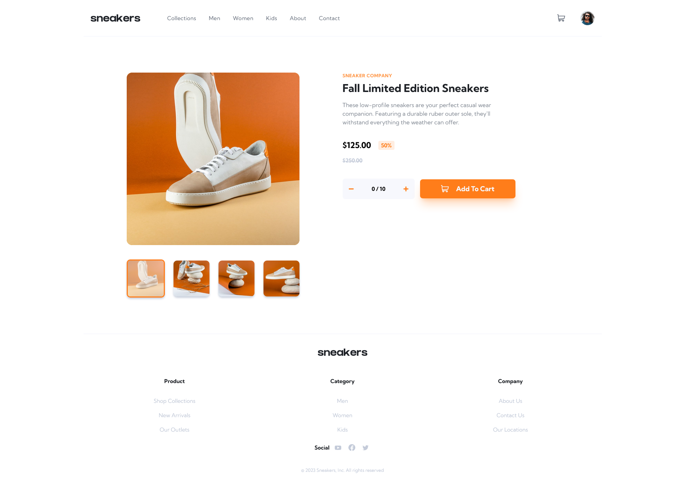
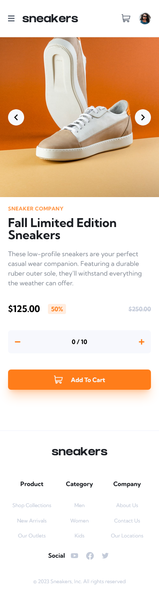

# Frontend Mentor - E-commerce product page solution

This is an **Extra featured** solution to the [E-commerce product page challenge on Frontend Mentor](https://www.frontendmentor.io/challenges/ecommerce-product-page-UPsZ9MJp6).

## Table of contents

- [Overview](#overview)
  - [The challenge](#the-challenge)
  - [Screenshot](#screenshot)
  - [Links](#links)
- [My process](#my-process)
  - [Built with](#built-with)
- [Author](#author)
- [Acknowledgments](#acknowledgments)

## Overview

### Screenshot

- Desktop Preview

  

- Mobile Preview

  

### Links

- Solution URL: [Add solution URL here](https://github.com/AhmadYousif89/sneaker-shop-nextjs)
- Live Site URL: [Add live site URL here](https://fe-sneakers.vercel.app)

### Built with

- [Next](https://nextjs.org/)
- [TailwindCss](https://tailwindcss.com/)
- [Zustand](https://docs.pmnd.rs/zustand/getting-started/introduction)
- Typescript
- Accessibility
- Semantic HTML5 markup
- Mobile-first workflow

## Author

- Frontend Mentor - [@Jo89](https://www.frontendmentor.io/profile/AhmadYousif89)
